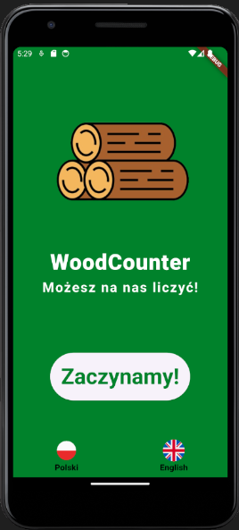

# Wood-Counter
## Projekt Grupowy
### Aplikacja powstała w ramach przedmiotu Projekt Grupowy i służy do pomiaru objętości drewna w stosie na podstawie zdjęcia jego przekroju.
### Autorzy: Jan Barczewski, Radosław Gajewski, Maciej Sikora

	

